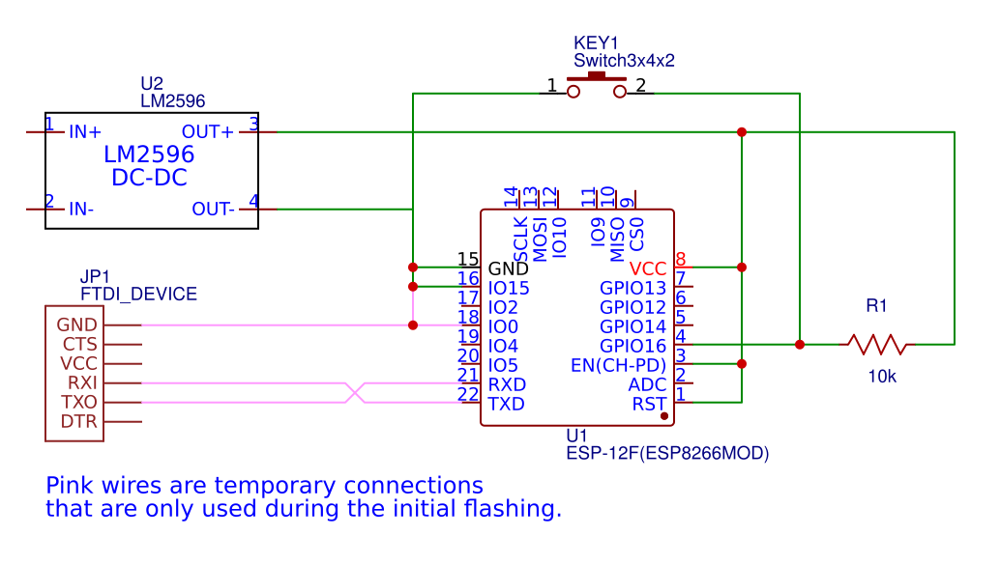

# scanbot

A simple modification to a $20 HP Deskjet 2600, using a $1.70 ESP8266 that automatically scans documents and saves them to network attached storage when the scanner lid is closed. 

There isn't anything about the design which is specific to this particular printer. You'll likely be able to use just about any other wifi-connectd scanner in a similar way. 

## hardware

This mod is built on top of the ESP8266. In particular, the ESP-12F, which can be found on sites like [AliExpress](https://www.aliexpress.com/item/Free-Shipping-ESP8266-remote-serial-Port-WIFI-wireless-module-through-walls-Wang-esp-12F/32473178476.html) for as low as $1.40 (with free shipping!). 

Conveniently, the HP deskjet's internal 22V DC power supply is a little brick just attached with two screws in the back. We can simply attach two additional wires to the 22V cables coming out of the power supply. To step the voltage down to the ESP8266's 3.3V level, we use a cheap $0.70 LM2596 adjustable voltage DC-DC step-down buck converter. 

## nas script

We have a little cgi-bin script that actually invokes the scanner running on a local network attached storage server (a raspberry pi). For the HP Deskjet 2600, you can remotely trigger and retrieve a scan by sending it a series of HTTP requests. 

The script also uses PIL to determine whether or not the current image is the same as the last one (in which case, it discards the newfound duplicate). It can also detect blank pages (i.e. an empty scanner), and it runs all scans through Tesseract and stores the text content into a single large file (for easy grepping). 

## initial firmware flash

To flash the ESP8266, we need to connect GPIO0 to GND, and connect a USB to serial adapter to the TX and RX pins. 

Follow [these instructions](https://arduino-esp8266.readthedocs.io/en/latest/installing.html) to add the ESP8266 to the Arduino IDE. 

Configure the ESP8266-Scanner-OTA sketch with your Wifi SSID and password. Also you should configure `ota_password`— anyone with this string will be able to remotely deploy updates to your ESP8266. 

Select the appropriate USB port, and upload the ESP8266-Scanner-OTA sketch. Open up the serial monitor and you should see the ESP8266 connect to your Wifi. If it is not able to connect successfully, try changing your SSID and upload the sketch again. 

Once that part all works, you should unplug the ESP8266, detach the GPIO0 connection (you can additionally unplug TX and RX), and turn it back on. 

## over the air updates

The Arduino IDE should detect the esp8266 automatically and you should be able to select it as a "port". To update the sketch remotely, just modify the code and hit upload as if there were a cable connected. Try to be careful around the OTA configuration code, as if that functionality breaks, you will need to re-attach GPIO0 and the UART serial adapter to fix it. 

